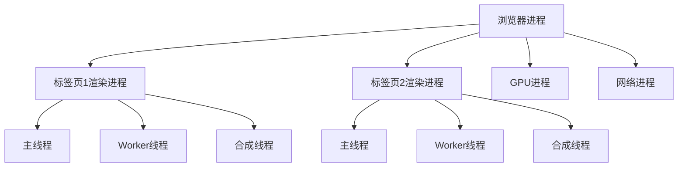
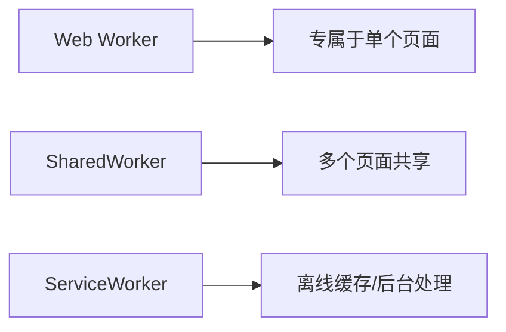
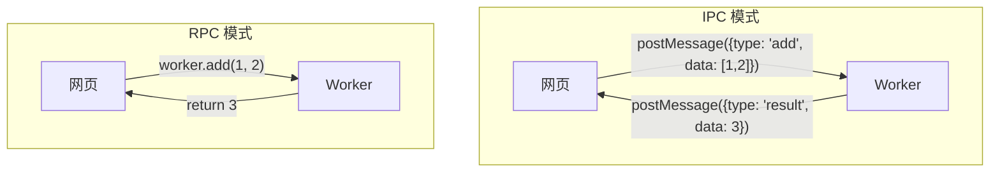
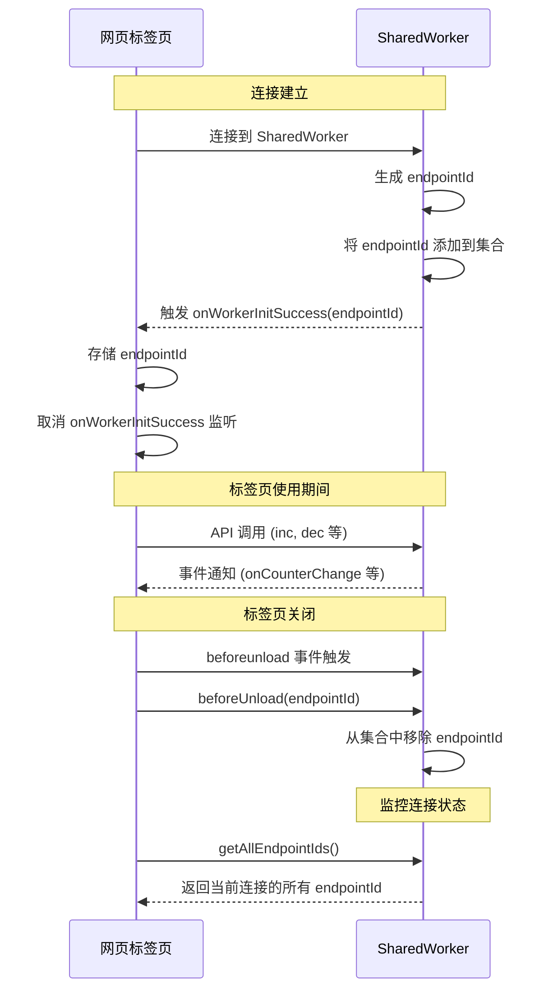

# SharedWorker 多标签页通信示例

这个项目演示了如何使用 SharedWorker 在多个标签页之间进行通信，并通过 Comlink 简化 Worker 通信模型。项目实现了一个简单的计数器应用，可以在多个标签页之间保持状态同步。

## 1. 浏览器多线程架构

### 浏览器的进程与线程模型

在现代浏览器中（如 Chrome），采用多进程架构：

- **浏览器进程**：管理浏览器的 UI、地址栏、书签等
- **渲染进程**：每个标签页通常会分配一个独立的渲染进程，负责页面渲染、JavaScript 执行等
- **网络进程**：处理网络请求
- **GPU 进程**：处理图形绘制
- **插件进程**：运行浏览器插件

在每个渲染进程内部，又有多个线程：

- **主线程（Main Thread）**：执行 JavaScript、处理 DOM、CSS 计算、布局和绘制等
- **合成线程（Compositor Thread）**：负责将页面图层合成为最终图像
- **Worker 线程**：执行 Web Worker、Service Worker 等



### Web Worker 的三种形态

1. **标准 Web Worker**：
   - 每个页面独享自己的 Worker
   - 无法在页面间共享状态
   - 与创建它的页面同生共死

2. **SharedWorker**：
   - 可以在同源的多个标签页或窗口之间共享
   - 允许多个页面共享同一个 Worker 实例和状态
   - 即使创建它的页面关闭，只要还有页面连接，它就会继续存在

3. **Service Worker**：
   - 作为网页和服务器之间的代理
   - 可以拦截网络请求并缓存资源
   - 即使页面关闭也能在后台运行，实现离线功能
   - 不直接与页面通信，而是通过 postMessage 事件



## 2. SharedWorker 兼容性

### 兼容性问题

SharedWorker 在一些浏览器中不被支持，特别是 Safari 和 iOS 浏览器长期不支持。为了解决这个问题，我们引入了 `@okikio/sharedworker` 提供降级方案。

### @okikio/sharedworker 提供的解决方案

这个库检测浏览器是否支持 SharedWorker，如果不支持，则自动降级到普通 Worker，同时保持 API 接口一致。

```typescript
// 使用方式
const { SharedWorkerSupported, SharedWorkerPonyfill } = await import("@okikio/sharedworker");
let myWorker;

if (SharedWorkerSupported) {
  myWorker = new SharedWorkerPonyfill(new SharedWorker(workerUrl));
} else {
  myWorker = new SharedWorkerPonyfill(new Worker(workerUrl));
}
```

这种方式使我们能够编写一套代码，同时支持两种场景，提高了应用的兼容性。

## 3. IPC 与 RPC 通信模式

### 3.1 IPC 与 RPC 的区别

**IPC (进程间通信)**:
- 专注于**如何传输数据**
- 是底层通信机制
- Web Worker 环境中的 `postMessage` 是典型 IPC 模式
- 需要手动编写消息处理、序列化和事件监听代码
- 开发者需要处理消息格式、事件注册和响应逻辑

**RPC (远程过程调用)**:
- 专注于**如何调用远程函数**
- 是对 IPC 的高级抽象
- 让远程函数看起来像本地函数
- 隐藏底层通信细节
- 提供更自然的编程模型



### 3.2 Comlink 库简介

Comlink 是 Google Chrome Labs 开发的库，它将复杂的 Worker 通信抽象为简单的函数调用，实现了从 IPC 到 RPC 的转变。

**Comlink 的主要优势**:
- 使用代理模式将远程对象包装成本地对象
- 自动处理序列化/反序列化
- 支持 async/await 语法
- 极大简化了 Worker 通信代码

**基本用法**:
```typescript
// Worker 端
import * as Comlink from 'comlink';

const api = {
  counter: 0,
  inc() { 
    this.counter++;
    return this.counter; 
  }
};

Comlink.expose(api);

// 主线程
import * as Comlink from 'comlink';

const workerApi = Comlink.wrap(new SharedWorker('worker.js').port);
const count = await workerApi.inc(); // 直接调用方法
```

### 3.3 Comlink 的扩展与改进

虽然 Comlink 简化了 Worker 通信，但它在事件监听模式方面存在不足。传统状态管理通常有 state、action 和事件监听机制，Comlink 原生不支持这种模式。

我们对 Comlink 进行了扩展，添加了事件订阅机制：

```typescript
// 定义事件名称和回调类型
const allEvents = ['onCounterChange', 'onWorkerInitSuccess'] as const;
type EventName = typeof allEvents[number];

interface EventCallbackMap {
  onCounterChange: (count: number) => void;
  onWorkerInitSuccess: (endpointId: string) => void;
}
```

这种设计允许:
1. 动态生成事件监听方法
2. 返回订阅 ID 用于后续取消订阅
3. 在多标签页中实时监听状态变化

在 React 环境下，我们创建了 `useSubWorkerEvent` hook 简化使用:

```typescript
function useSubWorkerEvent<T extends keyof EventCallbackMap>(
  eventName: T, 
  listener: EventCallbackMap[T]
) {
  // 实现事件订阅和清理
}

// 使用示例
useSubWorkerEvent('onCounterChange', (counter) => {
  setCount(counter);
});
```

### 3.4 SharedWorker 多标签页管理

在 SharedWorker 环境中，需要管理多个连接的标签页。特别是当我们需要跟踪哪些标签页仍然连接，哪些已经关闭时。

例如，当所有标签页都关闭或休眠时，我们可能希望断开 MQTT 连接以节省资源。

**标签页生命周期管理流程**:



我们通过 `getEndpointId` 函数实现这一机制:

```typescript
const getEndpointId = (() => {
  let globalEndpointId: string | null = null;
  let subId: string | null = null;
  return () => {
    return new Promise<string>((resolve) => {
      if (globalEndpointId) {
        resolve(globalEndpointId);
      }
      // 订阅 Worker 初始化成功事件
      workerApi.onWorkerInitSuccess(Comlink.proxy((endpointId: string) => {
        globalEndpointId = endpointId;
        // 设置页面关闭时的清理逻辑
        window.addEventListener('beforeunload', () => {
          workerApi.beforeUnload(endpointId);
        });
        resolve(endpointId);
        // 取消订阅防止覆盖
        if (subId) {
          workerApi.off(subId);
        }
      })).then((_subId: string) => {
        subId = _subId;
      });
    });
  };
})();
```

## 使用方法

1. 安装依赖:
```bash
pnpm install
```

2. 启动开发服务器:
```bash
pnpm dev
```

3. 打开多个浏览器标签页访问应用，可以看到计数器在所有标签页之间同步。

## 技术栈

- React
- TypeScript
- Vite
- Comlink
- SharedWorker
- @okikio/sharedworker (用于兼容性)