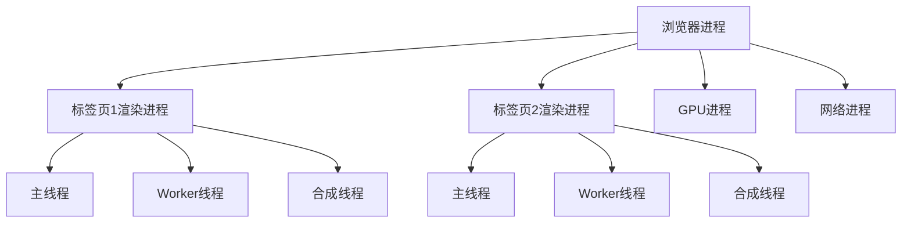
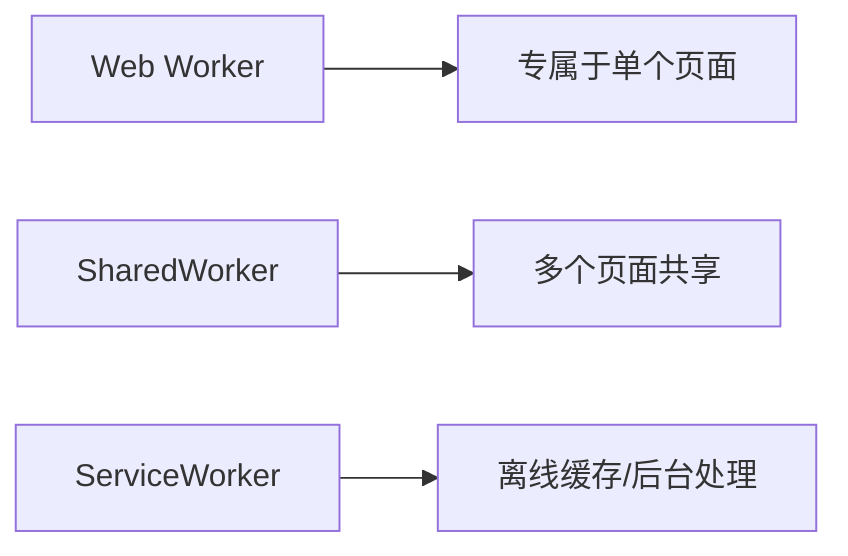
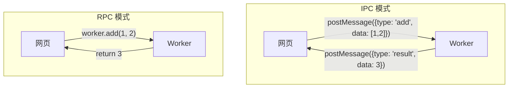

# SharedWorker 多标签页通信示例

这个项目演示了如何使用 SharedWorker 在多个标签页之间进行通信，并通过 Comlink 简化 Worker 通信模型。项目实现了一个简单的计数器应用，可以在多个标签页之间保持状态同步。

## 1. 浏览器多线程架构

### 浏览器的进程与线程模型

在现代浏览器中（如 Chrome），采用多进程架构：

- **浏览器进程**：管理浏览器的 UI、地址栏、书签等
- **渲染进程**：每个标签页通常会分配一个独立的渲染进程，负责页面渲染、JavaScript 执行等
- **网络进程**：处理网络请求
- **GPU 进程**：处理图形绘制
- **插件进程**：运行浏览器插件

在每个渲染进程内部，又有多个线程：

- **主线程（Main Thread）**：执行 JavaScript、处理 DOM、CSS 计算、布局和绘制等
- **合成线程（Compositor Thread）**：负责将页面图层合成为最终图像
- **Worker 线程**：执行 Web Worker、Service Worker 等



### Web Worker 的三种形态

1. **标准 Web Worker**：
   - 每个页面独享自己的 Worker
   - 无法在页面间共享状态
   - 与创建它的页面同生共死

2. **SharedWorker**：
   - 可以在同源的多个标签页或窗口之间共享
   - 允许多个页面共享同一个 Worker 实例和状态
   - 即使创建它的页面关闭，只要还有页面连接，它就会继续存在

3. **Service Worker**：
   - 作为网页和服务器之间的代理
   - 可以拦截网络请求并缓存资源
   - 即使页面关闭也能在后台运行，实现离线功能
   - 不直接与页面通信，而是通过 postMessage 事件



## 2. SharedWorker 兼容性

### 兼容性问题

SharedWorker 在一些浏览器中不被支持，特别是 Safari 和 iOS 浏览器长期不支持。为了解决这个问题，我们引入了 [`@okikio/sharedworker`](https://github.com/okikio/sharedworker) 提供降级方案。

### @okikio/sharedworker 提供的解决方案

这个库检测浏览器是否支持 SharedWorker，如果不支持，则自动降级到普通 Worker，同时保持 API 接口一致。这使开发者可以编写一套代码，同时支持两种场景。

```typescript
// 使用方式
const { SharedWorkerSupported, SharedWorkerPonyfill } = await import("@okikio/sharedworker");
let myWorker;

if (SharedWorkerSupported) {
  myWorker = new SharedWorkerPonyfill(new SharedWorker(workerUrl));
} else {
  myWorker = new SharedWorkerPonyfill(new Worker(workerUrl));
}
```

`SharedWorkerPonyfill` 类创建了一个统一的接口，使得无论底层是使用 SharedWorker 还是普通 Worker，代码都能以相同的方式工作。这极大提高了应用的兼容性，让我们能专注于业务逻辑而非兼容性问题。

## 3. IPC 与 RPC 通信模式

### 3.1 IPC 与 RPC 的区别

**IPC (进程间通信)**:
- 专注于**如何传输数据**
- 是底层通信机制
- Web Worker 环境中的 `postMessage` 是典型 IPC 模式
- 需要手动编写消息处理、序列化和事件监听代码
- 开发者需要处理消息格式、事件注册和响应逻辑

**RPC (远程过程调用)**:
- 专注于**如何调用远程函数**
- 是对 IPC 的高级抽象
- 让远程函数看起来像本地函数
- 隐藏底层通信细节
- 提供更自然的编程模型



### 3.2 Comlink 库简介

[Comlink](https://github.com/GoogleChromeLabs/comlink) 是 Google Chrome Labs 开发的库，它将复杂的 Worker 通信抽象为简单的函数调用，实现了从 IPC 到 RPC 的转变。

**Comlink 的主要优势**:
- 使用代理模式将远程对象包装成本地对象
- 自动处理序列化/反序列化
- 支持 async/await 语法
- 极大简化了 Worker 通信代码

**Comlink 通信限制**:
- **可序列化属性**：Comlink 只能传输可以被结构化克隆算法序列化的数据（如基本类型、数组、普通对象等）
- **方法传参**：方法的所有参数也必须是可序列化的
- **函数参数处理**：如需传递回调函数，必须用 `Comlink.proxy()` 包装，否则无法跨线程执行

**基本用法**:
```typescript
// Worker 端
import * as Comlink from 'comlink';

const api = {
  counter: 0,
  inc() { 
    this.counter++;
    return this.counter; 
  },
  // 注意：回调函数需要通过 Comlink.proxy 传递
  registerCallback(callback) {
    // callback 必须由调用方用 Comlink.proxy() 包装
    callback("This is a callback from worker!");
  }
};

Comlink.expose(api);

// 主线程
import * as Comlink from 'comlink';

const workerApi = Comlink.wrap(new SharedWorker('worker.js').port);
const count = await workerApi.inc(); // 直接调用方法

// 传递回调函数时必须用 Comlink.proxy() 包装
workerApi.registerCallback(Comlink.proxy((message) => {
  console.log(message); // "This is a callback from worker!"
}));
```

### 3.3 Comlink 的扩展与改进

虽然 Comlink 简化了 Worker 通信，但它在事件监听模式方面存在不足。传统状态管理通常有 state、action 和事件订阅机制，而 Comlink 原生不支持这种模式。

我们对 Comlink 进行了扩展，实现了一个完整的事件订阅系统：

```typescript
// 导入nanoid用于生成唯一ID
import { nanoid } from 'nanoid';

// 定义事件回调映射
export type EventCallbackMap = {
  counterChange: (counter: number) => void;
  endpointIdsChange: (endpointIds: string[]) => void;
}

// 定义监听器类型，使用字符串模板类型作为键
type ListenersType = {
  [K in keyof EventCallbackMap as `${string}__${K}`]?: EventCallbackMap[K];
}

// 定义回调方法集合类型
export type Callbacks = {
  [K in keyof EventCallbackMap]: (cb: EventCallbackMap[K]) => string;
}

// 使用类实现API
export class WorkerExposeApi {
  private listeners: ListenersType = {};
  counter: number;
  /** 记录所有连接的 endpointId，可直接通过属性访问 */
  endpointIds = new Set<string>();

  constructor() {
    this.counter = 0;
  }

  inc(num: number) {
    this.counter += num;
    // 通知所有监听器
    this.emit('counterChange', this.counter);
    return this.counter;
  }

  dec() {
    this.counter--;
    // 通知所有监听器
    this.emit('counterChange', this.counter);
    return this.counter;
  }

  // 添加监听器（客户端需要用 Comlink.proxy() 包装回调函数）
  addListener<T extends keyof EventCallbackMap>(eventName: T, cb: EventCallbackMap[T]) {
    const listenerId = `listenerId__${nanoid(8)}`;
    // @ts-expect-error: 无法避免的类型错误
    this.listeners[`${listenerId}__${eventName}`] = cb;
    return listenerId;
  }   

  // 私有方法，通知所有匹配到 eventName 的 callback 执行
  private emit<T extends keyof EventCallbackMap>(eventName: T, data: Parameters<EventCallbackMap[T]>[0]) {
    for (const listenerKey of Object.keys(this.listeners)) {
      if (listenerKey.includes(eventName)) {
        // @ts-expect-error: 无法避免的类型错误
        this.listeners[listenerKey](data);
      }
    }
  }

  // 取消监听器
  off(listenerId: string) {
    for (const listenerKey of Object.keys(this.listeners)) {
      if (listenerKey.startsWith(listenerId)) {
        delete this.listeners[listenerKey as keyof ListenersType];
      }
    }
  }

  // 添加新的端点 ID（由客户端生成并传入）
  addEndpointId(endpointId: string) {
    this.endpointIds.add(endpointId);
    // @ts-expect-error: 这里调用了 private 方法，但是预期不想暴露给客户端
    this.emit('endpointIdsChange', Array.from(this.endpointIds));
  }

  // 标签页关闭时移除端点 ID
  beforeUnload(endpointId: string) {
    this.endpointIds.delete(endpointId);
    // @ts-expect-error: 这里调用了 private 方法，但是预期不想暴露给客户端
    this.emit('endpointIdsChange', Array.from(this.endpointIds));
  }
}

// 创建单例实例
const exposeApi = new WorkerExposeApi();

// Worker连接处理
function start(port: MessagePort) {
  // 暴露API给客户端
  Comlink.expose(exposeApi, port);
}
```

在客户端，我们实现了 `getEndpointId` 函数，它能可靠地生成并管理当前标签页的 endpointId：

```typescript
const getEndpointId = (() => {
  let globalEndpointId: string | null = null;
  return () => {
    if (globalEndpointId) {
      return globalEndpointId;
    }
    // 客户端自己生成唯一的 endpointId
    globalEndpointId = `endpointId__${nanoid(8)}`;
    // 通知 worker 添加该 endpointId
    workerApi.addEndpointId(globalEndpointId);
    
    // 设置页面关闭时的清理逻辑
    window.addEventListener('beforeunload', () => {
      if (globalEndpointId) {
        workerApi.beforeUnload(globalEndpointId);
      }
    });
    
    return globalEndpointId;
  };
})();
```

此外，我们还创建了一些有用的React Hooks来简化API使用：

```typescript
// 订阅Worker事件的通用Hook
function useSubWorkerEvent<T extends keyof EventCallbackMap>(
  eventName: T, 
  listener: EventCallbackMap[T]
) {
  const listenerIdRef = useRef<string | null>(null);
  const isFirstTimeRender = useRef(true);
  
  useEffect(() => {
    if (isFirstTimeRender.current) {
      isFirstTimeRender.current = false;
      workerApi.addListener(eventName, Comlink.proxy(listener)).then((listenerId: string) => {
        listenerIdRef.current = listenerId;
      });
    }
  }, [eventName, listener]);

  // 组件卸载时自动取消订阅
  useEffect(() => {
    return () => {
      if (listenerIdRef.current) {
        workerApi.off(listenerIdRef.current);
      }
    }
  }, []);
}
```

在组件中获取所有连接端点的方式也得到了简化，现在可以直接访问 Worker 实例的 endpointIds 属性：

```typescript
function AppContent() {
  const [count, setCount] = useState(0);
  const [endpointIds, setEndpointIds] = useState<string[]>([]);
  const endpointId = getEndpointId();
  
  useEffect(() => {
    // 初始化获取计数值和端点ID列表
    async function init() {
      const value = await workerApi.counter;
      setCount(value);
      
      // 直接从 Worker 实例获取 endpointIds
      const ids = await workerApi.endpointIds;
      setEndpointIds(Array.from(ids));
    }
    init();
    
    // 监听端点ID变化
    useSubWorkerEvent('endpointIdsChange', (updatedIds: string[]) => {
      setEndpointIds(updatedIds);
    });
  }, []);
  
  // 其余组件代码...
}
```

这个架构使我们能够准确跟踪所有连接的标签页，并在标签页关闭时执行必要的清理。它解决了共享 Worker 应用中常见的资源管理和生命周期问题，特别适合需要维护共享状态的应用场景。